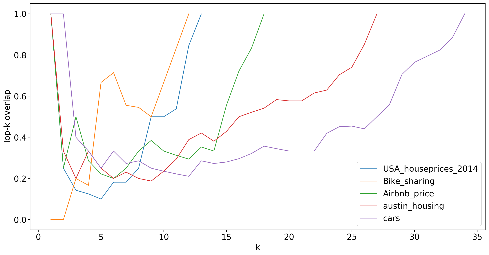

# KDS_Statistics_GroupProject
Repository containing source code, datasets and results of final project for "Advanced Applied Statistics and Multivariate Calculus", course of Data Science
master at [IT University of Copenhagen](https://en.itu.dk/).

### Prequisites
* Install packages described in [requirements.txt](requirements.txt) file

## Authors
* Jorge del Pozo Lérida, [@jorgedelpozolerida](https://github.com/jorgedelpozolerida)
* Mateusz Lemański, [@hiddenlemur](https://github.com/hiddenlemur)
* Janos Mate, [@matejanos](https://github.com/matejanos)
* Nicolas Obregon Royo,  [@nic-royo](https://github.com/nic-royo)

## Title
"Assessing the agreement between common feature selection methods on feature importance for different regression tasks"

## Abstract
Feature selection methods are routinely used in Machine Learning to reduce computational complexity and improve interpretability by selecting a set of features based on their order of importance. However, the assumption that different methods yield similar results when ranking the features is often made and selection of a certain method is normally based on specific requirements of the modeling task. This report tries to elucidate this assumption by testing if five different models commonly used for feature selection agree on the order of importance of the features for 5 different datasets. We have selected 5 different models — Linear and Ridge Regression, Elastic Net, CART, Random Forests — and compared their feature importance rank lists using Kendall’s W as well as performed a hypothesis test. Based on the study, we conclude that there is sufficient evidence to say that there is some agreement between the methods. We then argue that the level of agreement is quite strong, specially for the first few most important features, based on the value of the top-k overlap and W.

## Methods and Results
Our research question is the following: "Do different feature selection methods agree on the ranking of importance of our features?". 

To test it, we selected 5 different models — Linear and Ridge Regression, Elastic Net, CART, Random Forests — and compared their feature importance rank lists using Kendall’s W and performing hypothesis testing on 5 different datasets. 

The results of Kendall's W for all datasets are the following:

And for Top-k overlap:

 
We conclude that there is sufficient evidence to say that there is some agreement between the methods and we then argue that the level of agreement is quite strong, specially for the first few most important features.
